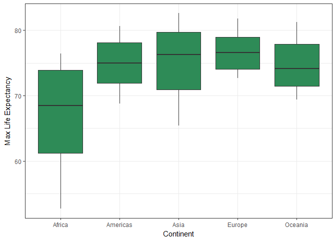
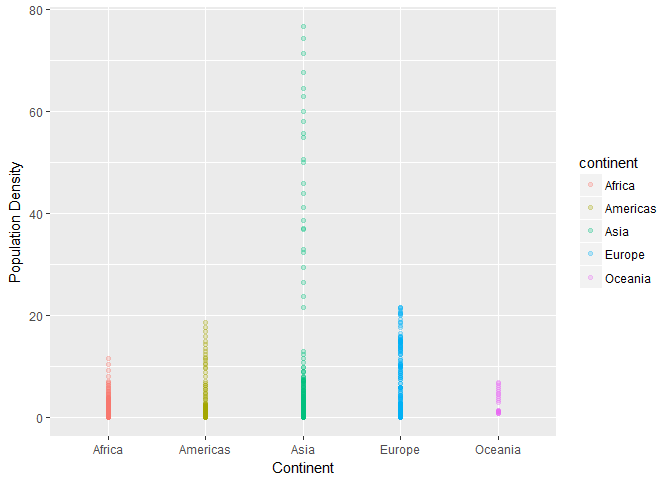
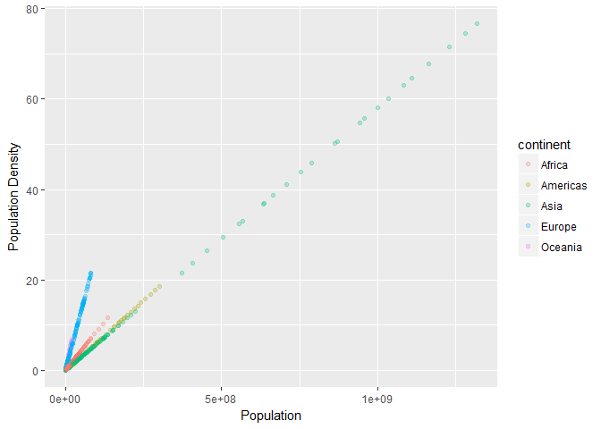
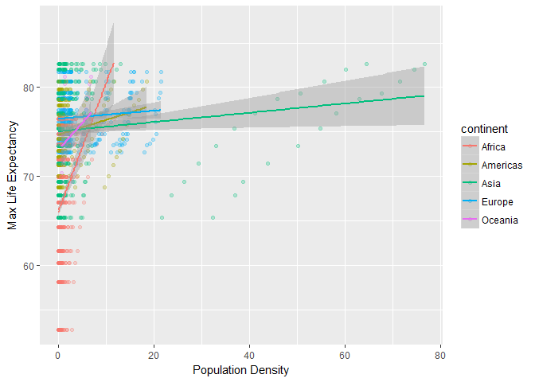
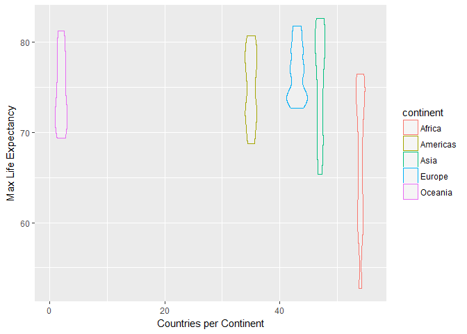

# hw4
Wade  
October 7, 2017  

<h3>Homework 4</h3>

In this assignment, I have been asked to perform a <i>reshaping</i> task and a <i>join</i> task.


I'll start with loading the packages I need.


```r
library(gapminder)
library(tidyr)
library(dplyr)
```

```
## 
## Attaching package: 'dplyr'
```

```
## The following objects are masked from 'package:stats':
## 
##     filter, lag
```

```
## The following objects are masked from 'package:base':
## 
##     intersect, setdiff, setequal, union
```

```r
library(ggplot2)
```

I loaded some tidyverse packages separately because loading tidyverse led to errors whenever I tried to render this file to HTML. I still have not been able to resolve this issue.

<h4>Task 1</h4>

Let's begin with the reshaping task.


"Compute some measure of life expectancy (mean? median? min? max?) for all possible combinations of continent and year. Reshape that to have one row per year and one variable for each continent. Or the other way around: one row per continent and one variable per year."


```r
g<- gapminder %>%
  group_by(continent, year)%>%
  summarize(max_le=max(lifeExp))

knitr::kable(g, col.names=c("Continent","Year", "Max L.Exp"), format = "markdown")
```


|Continent | Year| Max L.Exp|
|:---------|----:|---------:|
|Africa    | 1952|    52.724|
|Africa    | 1957|    58.089|
|Africa    | 1962|    60.246|
|Africa    | 1967|    61.557|
|Africa    | 1972|    64.274|
|Africa    | 1977|    67.064|
|Africa    | 1982|    69.885|
|Africa    | 1987|    71.913|
|Africa    | 1992|    73.615|
|Africa    | 1997|    74.772|
|Africa    | 2002|    75.744|
|Africa    | 2007|    76.442|
|Americas  | 1952|    68.750|
|Americas  | 1957|    69.960|
|Americas  | 1962|    71.300|
|Americas  | 1967|    72.130|
|Americas  | 1972|    72.880|
|Americas  | 1977|    74.210|
|Americas  | 1982|    75.760|
|Americas  | 1987|    76.860|
|Americas  | 1992|    77.950|
|Americas  | 1997|    78.610|
|Americas  | 2002|    79.770|
|Americas  | 2007|    80.653|
|Asia      | 1952|    65.390|
|Asia      | 1957|    67.840|
|Asia      | 1962|    69.390|
|Asia      | 1967|    71.430|
|Asia      | 1972|    73.420|
|Asia      | 1977|    75.380|
|Asia      | 1982|    77.110|
|Asia      | 1987|    78.670|
|Asia      | 1992|    79.360|
|Asia      | 1997|    80.690|
|Asia      | 2002|    82.000|
|Asia      | 2007|    82.603|
|Europe    | 1952|    72.670|
|Europe    | 1957|    73.470|
|Europe    | 1962|    73.680|
|Europe    | 1967|    74.160|
|Europe    | 1972|    74.720|
|Europe    | 1977|    76.110|
|Europe    | 1982|    76.990|
|Europe    | 1987|    77.410|
|Europe    | 1992|    78.770|
|Europe    | 1997|    79.390|
|Europe    | 2002|    80.620|
|Europe    | 2007|    81.757|
|Oceania   | 1952|    69.390|
|Oceania   | 1957|    70.330|
|Oceania   | 1962|    71.240|
|Oceania   | 1967|    71.520|
|Oceania   | 1972|    71.930|
|Oceania   | 1977|    73.490|
|Oceania   | 1982|    74.740|
|Oceania   | 1987|    76.320|
|Oceania   | 1992|    77.560|
|Oceania   | 1997|    78.830|
|Oceania   | 2002|    80.370|
|Oceania   | 2007|    81.235|


```r
ggplot(g, aes(x=continent, y=max_le))+
  geom_boxplot(fill="seagreen")+
  labs(x="Continent", y="Max Life Expectancy")+
  theme_bw()
```

<!-- -->

It looks like the dataframe we have now is in long format, but we want to change it to wide format so that each continent has its own column. To do this we will use the spread() function.


```r
wide_g <- spread(g, continent, max_le)
wide_g
```

```
## # A tibble: 12 × 6
##     year Africa Americas   Asia Europe Oceania
## *  <int>  <dbl>    <dbl>  <dbl>  <dbl>   <dbl>
## 1   1952 52.724   68.750 65.390 72.670  69.390
## 2   1957 58.089   69.960 67.840 73.470  70.330
## 3   1962 60.246   71.300 69.390 73.680  71.240
## 4   1967 61.557   72.130 71.430 74.160  71.520
## 5   1972 64.274   72.880 73.420 74.720  71.930
## 6   1977 67.064   74.210 75.380 76.110  73.490
## 7   1982 69.885   75.760 77.110 76.990  74.740
## 8   1987 71.913   76.860 78.670 77.410  76.320
## 9   1992 73.615   77.950 79.360 78.770  77.560
## 10  1997 74.772   78.610 80.690 79.390  78.830
## 11  2002 75.744   79.770 82.000 80.620  80.370
## 12  2007 76.442   80.653 82.603 81.757  81.235
```


```r
knitr::kable(wide_g, caption = "Maximum Life Expectancy", format = "markdown")
```


| year| Africa| Americas|   Asia| Europe| Oceania|
|----:|------:|--------:|------:|------:|-------:|
| 1952| 52.724|   68.750| 65.390| 72.670|  69.390|
| 1957| 58.089|   69.960| 67.840| 73.470|  70.330|
| 1962| 60.246|   71.300| 69.390| 73.680|  71.240|
| 1967| 61.557|   72.130| 71.430| 74.160|  71.520|
| 1972| 64.274|   72.880| 73.420| 74.720|  71.930|
| 1977| 67.064|   74.210| 75.380| 76.110|  73.490|
| 1982| 69.885|   75.760| 77.110| 76.990|  74.740|
| 1987| 71.913|   76.860| 78.670| 77.410|  76.320|
| 1992| 73.615|   77.950| 79.360| 78.770|  77.560|
| 1997| 74.772|   78.610| 80.690| 79.390|  78.830|
| 2002| 75.744|   79.770| 82.000| 80.620|  80.370|
| 2007| 76.442|   80.653| 82.603| 81.757|  81.235|

Here we have our data reshaped to display maximum life expectancy with one row per year and one variable for each continent. 


<h4>Task 2</h4>

"Create a second data frame, complementary to Gapminder. Join this with (part of) Gapminder using a  dplyr join function and make some observations about the process and result. Explore the different types of joins. "

First, we will create the second dataframe:


```r
new.data<- gapminder%>%
  select(country, continent, year, pop)

hem <- c("Eastern", "Eastern", "Western", "Eastern", "Eastern")
index<- c("Asia", "Africa", "Americas", "Europe", "Oceania")
new.data$hemisphere<-hem[match(new.data$continent, index)] 

countries_per_continent<-c(47, 54, 35, 43, 2)
new.data$countryPerCont<-countries_per_continent[match(new.data$continent, index)]


continent_size<- c(17212000, 11608000, 16245000, 3837000, 2968000)
new.data$continentSizeSqKm<-continent_size[match(new.data$continent, index)]

new.data<-new.data%>%
  mutate(popDensity = pop/continentSizeSqKm)
head(new.data)
```

```
## # A tibble: 6 × 8
##       country continent  year      pop hemisphere countryPerCont
##        <fctr>    <fctr> <int>    <int>      <chr>          <dbl>
## 1 Afghanistan      Asia  1952  8425333    Eastern             47
## 2 Afghanistan      Asia  1957  9240934    Eastern             47
## 3 Afghanistan      Asia  1962 10267083    Eastern             47
## 4 Afghanistan      Asia  1967 11537966    Eastern             47
## 5 Afghanistan      Asia  1972 13079460    Eastern             47
## 6 Afghanistan      Asia  1977 14880372    Eastern             47
## # ... with 2 more variables: continentSizeSqKm <dbl>, popDensity <dbl>
```

Here I have created a second dataframe called new.data that lists the country, continent, year, population, hemisphere, number of countries on each continent, and size of each continent. I've also created a relative measure of population density based on continent size.

Next, I will experiment with various ways to join new.data with the gapminder dataset.

Let's try to join this dataset with a version of gapminder we created earlier.


```r
gap.new1<-semi_join(g, new.data)
```

```
## Joining, by = c("continent", "year")
```

```r
head(gap.new1)
```

```
## Source: local data frame [6 x 3]
## Groups: continent [1]
## 
##   continent  year max_le
##      <fctr> <int>  <dbl>
## 1      Asia  1952  65.39
## 2      Asia  1957  67.84
## 3      Asia  1962  69.39
## 4      Asia  1967  71.43
## 5      Asia  1972  73.42
## 6      Asia  1977  75.38
```

That doesn't appear to have worked. The popDensity variable I created is not on this table. A lot of other variables are missing too.


```r
g.new1<- left_join(g, new.data, by = c("continent", "year"))
View(g.new1)
```

This appears to have worked, but the life expectancy max is in a wierd spot. Let's try another one.


```r
g.new2<- full_join(g, new.data, by = c("continent", "year"))
View(g.new2)
```

This one has the same problem. I think a reversed left join might work.


```r
g.new3<- left_join(new.data, g, by = c("continent", "year"))
View(g.new3)
```

Perfect! This is the one I was looking for.

Just for fun, let's see what variables affect the population density variable.


```r
ggplot(data=g.new3, aes(x=continent, y=popDensity, color=continent))+
  geom_point(alpha=.25)+
  labs(x="Continent", y="Population Density")
```

<!-- -->


```r
ggplot(data=g.new3, aes(x=pop, y=popDensity, color=continent))+
  geom_point(alpha=.25)+
  labs(x="Population", y="Population Density")
```

<!-- -->

All right, clearly we know that population and continent are associated with the population density measure we created. This is true by definition. What else may be associated with popDensity?


```r
ggplot(data=g.new3, aes(x=popDensity, y=max_le, color=continent))+
  geom_point(alpha=.25)+
  labs(x="Population Density", y="Max Life Expectancy")+
  geom_smooth(method="lm")
```

<!-- -->


```r
ggplot(data=g.new3, aes(x=countryPerCont, y=max_le, color=continent))+
  geom_violin(alpha=.25)+
  labs(x="Countries per Continent", y="Max Life Expectancy")
```

<!-- -->

I suppose that due to the way the data are clustered, this graph does not add much more than what we would learn from just plotting the continent against max life expectancy.

It looks like, for the most part, lower population density predicts higher life expectancy, although this is not always the case.


<h1>Process</h1>
<li>I used <a href=http://www.enchantedlearning.com/geography/continents/Extremes.shtml> this website </a> for data about the world's continents.</li>
<li>When I began the assignment, I did not know where to start</li>
<li>I think in that type of situation, the best thing to do is just start anywhere. Something you do in the early stages may provide you with a better sense of direction</li>
<li>Still, I felt as if in the beginning I did not have the knowledge I needed to complete the assignment</li>
<li>I Googled things frequently</li>
<li>I especially needed extra help understanding wide vs long data.</li>


